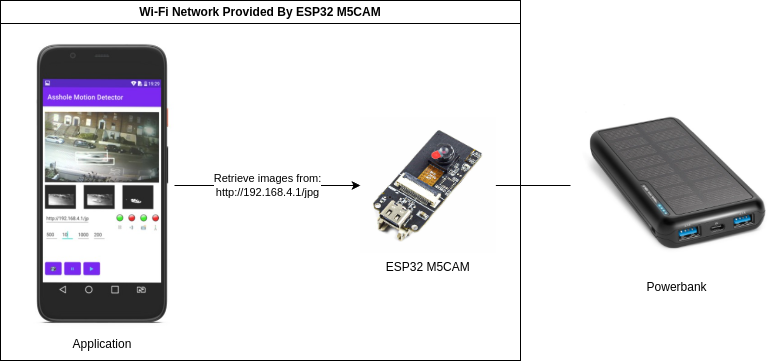
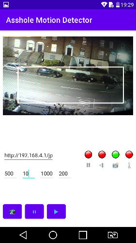

# Camera Motion Detector

## Overview
The Camera Motion Detector, an Android application, is designed to connect to a video source like the ESP32 M5CAM, and uses OpenCV to detect motion. Upon detecting movement, it alerts users through sound notifications.

Here is a diagram involving ESP32 M5CAM:

> Note: The actual name of the application is "As*hole Movement Detector" due to initial reason I developed it. Sorry for that!

## Getting Started

### Prerequisites
- Build the application or download and install the `.apk` from [Release v0.0.1](https://github.com/AmirrezaNasiri/camera-motion-detector/releases/tag/v0.0.1).
- Access to the video source's network (if it's private and not available over the Internet). For ESP32 M5CAM, connect to its Wi-Fi network (SSID is usually something like this: `M5Psram_Cam`, `m5stack-`, or similar).
- Knowledge of your video source's JPEG stream URL. For ESP32 M5CAM, the default is `http://192.168.4.1/jpg`

### Initial Setup
1. Ensure you're connected to the video source's network.
2. Launch the app and enter the JPEG stream URL.
3. Let it load images from the source.

### Configuring Detection Area
Define the detection zone by drawing one or more rectangles within the image as shown here:

### Starting Detection
Click the start (resume) button to begin motion detection. Refer to this UI guide for more details:
  

## Development
1. Clone the repository.
2. Install [OpenCV 4.5.5 SDK](https://docs.opencv.org/4.5.5/da/d2a/tutorial_O4A_SDK.html) into `sdk` directory in project root.
3. Build the apk output.

## Considerations
- This is a personal, non-commercial project.
- It may contain bugs and might not function as expected.
- The provided `.apk` file in the release is not signed and does not support Android 9+ due to API changes.
- A solution for the API issue is included in the `AndroidManifest.xml`, but a new build with this fix has not been generated.
